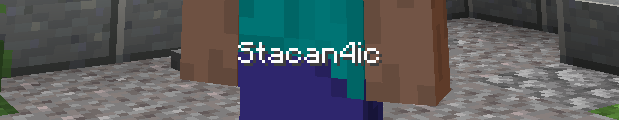

# 🛠 Механики сервера

## Плагин на позы

Для простоты игры мы добавили в майнкрафт позы, он разбавит ванильный майнкрафт не навредив ему.

**/sit** — Сидеть на блоке\
**/lay** — Лежать на блоке\
**/bellyflop** — Плюхнуться на блок\
**/crawl** — Ползать по земле\
**/sit toggle** — Переключить возможность щелкать правой кнопкой мыши по блокам или игрокам

<figure><figcaption>
пример : /sit
</figcaption></figure>

## Выпадение голов

На сервере есть специальный плагин, благодаря которому при каждой смерти от рук другого игрока из вас выпадает ваша голова. Это можно использовать как Декорацию или же трофей.

<figure><figcaption>
пример : головы игроков на стене
</figcaption></figure>

## Голосовой чат

На нашем сервере есть голосовой мод. С помощью которого можно говорить прямо в самом майнкрафте. Загляните в категорию "[моды](../vazhno/mody.md#plasmovoice)"\

<figure><figcaption>
пример : отсуствует мод , разговаривет , замучен
</figcaption></figure>

## Ресурс паки

Наша администрация сервера постаралась и сделала ресурс пак сервера, он выдается автоматически при заходе на сервер. Он практически не как не влияет на игру. С его помощью получается сделать например такое :&#x20;

<figure><figcaption>
пример : немного ресурспака
</figcaption></figure>

## Эмоции

На нашем сервере есть мод на эмоции. С помощью которого можно показать свою реакцию или же как-то отыграть по рп. Загляните в категорию "[моды](../vazhno/mody.md#plasmovoice)"

<figure><figcaption>
пример : Эмоция (JOJO-поза) 
</figcaption></figure>

## Локации

На сервере присутствуют локации , это места где вы можете убивать кого хотите и вам за это нечего не будет , еще особенность их в луте , тут вы можете найти как обычный лут так и уникальный , еще здесь есть много секретов которые относятся к сюжету , а также крафты предметов (о них ниже)

<figure><figcaption>
пример : локация на сервере
</figcaption></figure>

## Крафты&#x20;

На сервере была переработана слегка механика крафтов некоторых предметов , каких именно  вам стоит узнать на самом сервере , а крафты этих предметов можно найти в локациях

<figure><figcaption>
пример : фото верстака , хз
</figcaption></figure>

