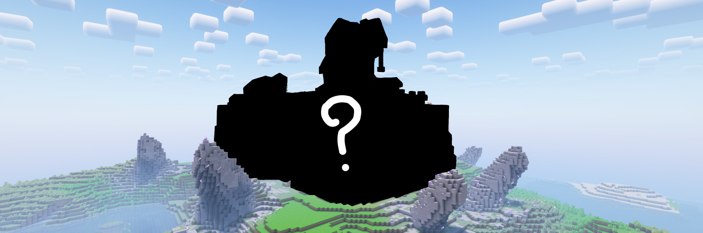
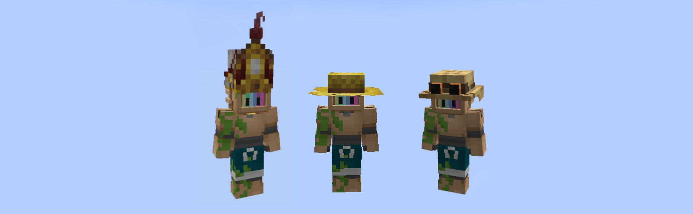

# 🛠 Механики сервера

## Позы

На сервере есть такая возможность как сидеть  , лежать , ползать , упасть на блок. Это разнообразит  мир не навредив ему.

<figure><figcaption>
пример : сидим
</figcaption></figure>

## Выпадение голов

После смерти от рук другого игрока , выпадет голова. Это можно использовать как декорацию или же трофей.

<figure><figcaption>
пример : головы игроков на стене
</figcaption></figure>

## Голосовые чат

На сервере есть возможность разговаривать с другими игроками прямо в майнкрафте , для этого вам понадобится[ установить](../../vazhno/mody.md#plasmovoice) мод.

<figure><figcaption>
пример : не установил возможность , разговаривает , замучен
</figcaption></figure>

## Текстурпак

Нашей администраций и другими людьми был разработан текстурпак для приятной игры на сервере. Все делается путем переименования предметов на наковальне. Помощь(сделать ссылку на хелпак)&#x20;

<figure><figcaption>
пример : немного ресурспака
</figcaption></figure>

## Эмоции

На сервере присутствуют эмоции для большего разнообразия. С помощью их вы сможете передавать свои эмоции , отыгрывать рп и весело проводить время , но для этого надо [установить](../../problemy/mody.md#emotecraft) мод.

<figure><figcaption>
пример : Эмоция (JOJO-поза) 
</figcaption></figure>

## Реальности

В них вы можете убивать других людей , тут мы без сильны , еще тут есть , как обычные наши вещи так и из других реальностей , а еще тут есть способы новых крафтов .

<figure><figcaption>
пример : другая реальность на сервере
</figcaption></figure>

## Крафты&#x20;

Из-за частей других реальностей , несколько наших крафтов были изменены , ищите способы их крафта в других реальностях.

<figure><figcaption>
пример : фото верстака , хз
</figcaption></figure>

## Карта мира

На сервере присутствует карта изведанных территорий , для того чтоб вы могли смотреть где и чем занимается другой игрок прямо сейчас , так же можно просматривать просто открытую территорию карты.

<figure><figcaption>
пример : вид карты
</figcaption></figure>

## Шапки

Делается переименованием вырезанной тыквы , можно использовать как аксессуар или же декорацию в доме.

<figure><figcaption>
пример : три шапки из 170+
</figcaption></figure>

## Одежда

На столько же крутое дополнение как и шапки , делается переименованием определённого типа брони. Можно использовать как аксессуар или же как элемент (РП)

(фото)

## Новая еда

На данный момент не имеет какую либо особенность или же способ приготовления , делается путем переименования другой классической еды на наковальне. Подойдет для каких либо кафе или (РП) ситуаций&#x20;

(фото)

